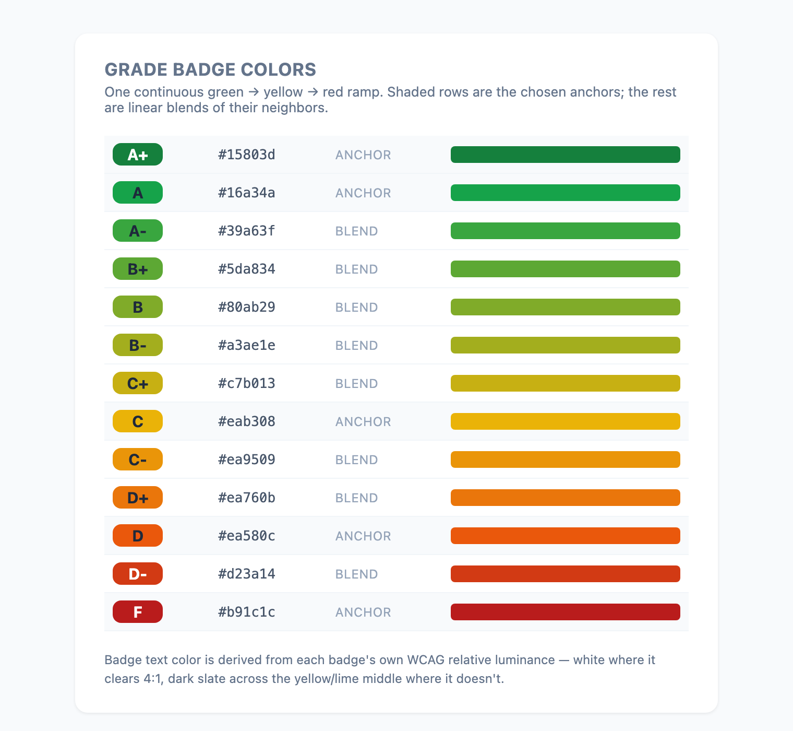
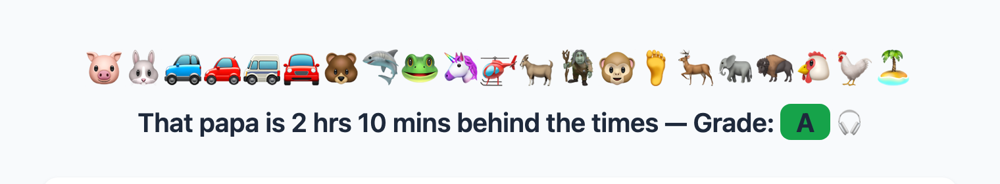
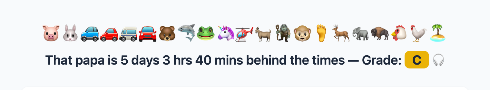
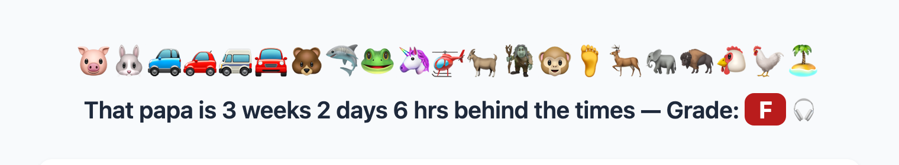
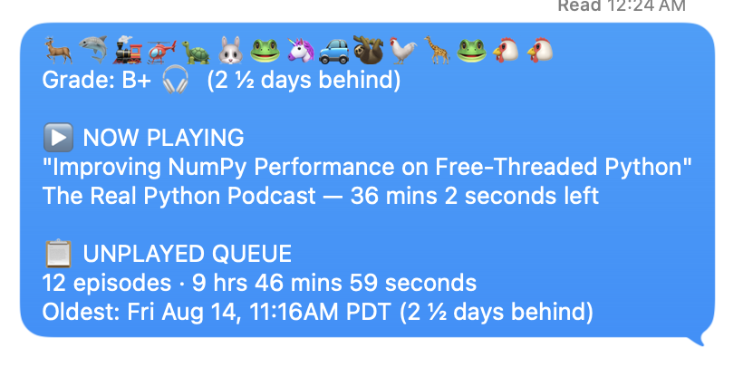
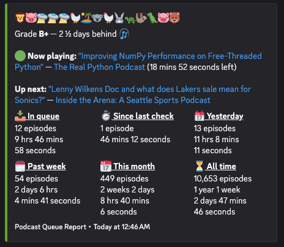

# Podcast Queue Report

> **Reference implementation only.** This repo was built and tested against
> one specific Mac (with Apple Podcasts installed and a particular library
> layout) inside an AI coding session. It is **not verified or validated to
> run on other macOS systems** — Apple's Podcasts database schema is
> undocumented, private, and can change without notice between app/OS
> versions. Treat this as a working example to read, learn from, and adapt,
> not a plug-and-play tool. See "Known caveats" below.

Reads a local Apple Podcasts library (SQLite) and generates a summary of the
"Latest Episodes" unplayed queue plus listening stats, with a letter grade
for how many days behind the oldest unplayed episode is.

## In action

The source data — Apple Podcasts' own "Latest Episodes" unplayed queue view:


The generated HTML report:


Grades are color-coded on one continuous green &rarr; yellow &rarr; red
ramp. Only five anchors are chosen — A+ deep green, A green, C yellow, D
orange, F red — and every other grade is a linear RGB blend of its
neighbors, so a +/- step reads as "slightly worse than" rather than as its
own category:



The same ramp in the report headline, at three points on the scale:





Badge text color isn't fixed either — it's derived from each badge's own
WCAG relative luminance, since white text goes unreadable across the
yellow/lime middle of the ramp. Regenerate the swatch sheet after any
palette change with `python3 scripts/make_grade_swatches.py`, which reads
the colors from `render_report.py` itself rather than re-listing them.

The SMS text, as received:



The Discord embed, as posted:



## Setup

```bash
git clone <this-repo-url> "podcast-queue-report"
cd podcast-queue-report
make setup          # copies .env.example -> .env
# now edit .env with your own timezone, email, phone, etc.
make chat            # first run — prints the chat summary
```

No external Python dependencies are required (standard library only,
including a minimal built-in `.env` loader). `make` is preinstalled on
macOS (via Xcode Command Line Tools) — if `make setup` says "command not
found," run `xcode-select --install` first, or just do the two steps by
hand: `cp .env.example .env`, then edit it.

Optional: install [`nowplaying-cli`](https://github.com/ungive/nowplaying-cli)
(`brew install nowplaying-cli`) to have reports call out an episode you're
actively playing right now ("Now playing"). Without it, every report just
skips that section — nothing else depends on it.

### Using this as a Claude Code skill

To let Claude (via Claude Code or Claude Cowork) run this on your behalf:

1. Clone this repo somewhere on disk, and fill in `.env` as above.
2. Point Claude at it — e.g. ask it to "read `SKILL.md` in this repo and use
   it to run my podcast queue report," or copy `SKILL.md` into your own
   Claude skills directory (`~/.claude/skills/podcast-queue-report/` for
   Claude Code, or save it as a Cowork skill) and adjust the file paths
   inside it to point at wherever you cloned this repo.
3. Claude will need read access to your Apple Podcasts library at
   `~/Library/Group Containers/243LU875E5.groups.com.apple.podcasts/Documents/`
   and to this repo's folder.

## Quick commands (Makefile)

This is the recommended way to run everything — for both humans and an AI
agent working in this repo. Run `make help` any time for the full list.

| Command | What it does |
|---|---|
| `make setup` | First-time setup: copies `.env.example` to `.env` |
| `make run` | Queries the Podcasts DB once, writes `/tmp/podcast_run.json` |
| `make chat` | Prints the chat summary (preview only, nothing sent) |
| `make html` | Regenerates `reports/podcast_report.html` |
| `make email` | Emails the report via Outlook (needs `REPORT_EMAIL` in `.env`) |
| `make sms` | Texts the report via Messages.app (needs `REPORT_PHONE` in `.env`) |
| `make discord` | Posts the chat summary to Discord via webhook (needs `DISCORD_WEBHOOK_URL` in `.env`) |
| `make open` | Regenerates the HTML report and opens it in your default browser (macOS `open`) |
| `make all` | Runs the query once, then chat + html + email + sms + discord (each send skips cleanly if unconfigured) |
| `make unlock` | Clears stale git lock files (see `scripts/git_unlock.py`) |
| `make commit MSG='...'` | Unlocks, stages everything, commits |
| `make clean` | Removes the scratch `/tmp/podcast_run.json` file |

`npm start` is a shortcut for `make all` followed by opening the fresh HTML
report in your browser, with a `time` around the whole thing.

`chat`, `html`, `sms`, and `discord` each depend on `run`; `email` depends
on `html` (so the HTML report already exists to attach). Calling any one of
them alone re-queries the database fresh; `make all` only queries once and
reuses that same snapshot for everything it does (important, since each
query also advances the "since last check" stats window — you don't want
`make all` to silently zero that out by running the query five times in a
row).

`make open` uses the standard macOS `open` command, so it launches your
actual default browser — but only when run from a real shell on the Mac
(a Terminal, or Claude Code with direct shell access). It will silently do
nothing useful from inside Claude Cowork's sandboxed bash, since that shell
is an isolated Linux container with no path to your real screen. In that
environment, an AI agent running this skill should present the HTML file to
you to open yourself, or use OS-level screen control — see `SKILL.md`.

### Running the underlying scripts directly

The Makefile is a thin wrapper — you can always call the Python directly:

```bash
python3 podcast_summary.py > /tmp/run.json
python3 render_report.py /tmp/run.json chat   # plain-text chat summary
python3 render_report.py /tmp/run.json sms    # short SMS text
python3 render_report.py /tmp/run.json email  # SUBJECT: ... / body
python3 render_report.py /tmp/run.json html > reports/podcast_report.html
```

## Files

- `podcast_summary.py` — queries the Podcasts SQLite database, computes the
  unplayed queue (with a reverse-engineered heuristic — see caveats below),
  listening stats for several time windows, episode/podcast links, and
  writes JSON to stdout. Durations are formatted human-friendly (e.g. "1 day
  2 hrs 38 mins 12 seconds") and episode/podcast titles link to their Apple
  Podcasts pages. Reads configuration from environment variables / `.env`.
- `render_report.py` — renders that JSON into a chat summary, SMS text, email
  (subject + body), or a styled standalone HTML report.
- `reports/podcast_report.html` — the most recently generated HTML report.
- `Makefile` — convenience commands wrapping the two scripts above; see
  "Quick commands" below.
- `scripts/git_unlock.py` — clears stale git lock files on filesystems that
  block deletes (see its own docstring for the full story).
- `scripts/make_grade_swatches.py` — regenerates `assets/grade-colors.png`,
  the grade color swatch sheet in "In action" above, straight from
  `render_report.py`'s own palette functions.
- `.env.example` — template for the environment variables below. Copy to
  `.env` (gitignored) and fill in your own values.
- `.podcast_skill_state.json` (gitignored, local only) — tracks the last run
  timestamp, used for the "since last check" played-stats window.
- `SKILL.md` — self-contained instructions for an AI agent (e.g. Claude) to
  run this report and automatically deliver it by email, text, and/or
  Discord, gated by which `.env` variables are configured.

## Environment variables

| Variable | Purpose | Default if unset |
|---|---|---|
| `PODCASTS_DB_PATH` | Path to `MTLibrary.sqlite` | Auto-detects the standard macOS location |
| `REPORT_TIMEZONE` | IANA timezone for date/window boundaries | `UTC` |
| `REPORT_SIGNOFF_NAME` | Name used in the email sign-off | (omitted if unset) |
| `REPORT_EMAIL` | Delivery email address - `make email` (Outlook) skips if unset | (none) |
| `REPORT_PHONE` | Delivery phone number - `make sms` (Messages.app) skips if unset | (none) |
| `REPORT_LABEL` | Prefix used to build the email subject line | `Podcast Queue Report` |
| `DISCORD_WEBHOOK_URL` | Discord webhook - `make discord` skips if unset | (none) |

## Grading scale

Grade is based on how many days behind the oldest unplayed episode's publish
date is versus now (in `REPORT_TIMEZONE`).

| Days behind      | Grade |
|-------------------|:-----:|
| Queue is empty     | A+    |
| 0 days             | A     |
| 1 day               | A-    |
| 2 days              | B+    |
| 3 days              | B     |
| 4 days              | B-    |
| 5 – 7 days          | C+ / C / C- |
| 8 – 10 days         | D+ / D / D- |
| 11+ days            | F     |

## Delivery

`make email`, `make sms`, and `make discord` each send for real -
`scripts/send_email.py` drives Outlook, `scripts/send_sms.py` drives
Messages.app (both via AppleScript, macOS only), and
`scripts/post_discord.py` posts to a webhook. Each skips cleanly with an
explanatory message if its `.env` destination (`REPORT_EMAIL`,
`REPORT_PHONE`, `DISCORD_WEBHOOK_URL`) is blank - that's the on/off switch
for each channel, there's no per-run confirmation prompt. `make all` /
`npm start` run all of it from one query. See `SKILL.md` for how an AI
agent should drive this.

## Known caveats

- The unplayed-queue detection (`ZUNPLAYEDTAB=1` for subscribed podcasts,
  one episode per podcast — its newest unplayed — capped to the 12 most
  recent across all shows, via `LATEST_EPISODES_LIMIT` in
  `podcast_summary.py`) was reverse-engineered from Apple's undocumented
  internal schema by comparing SQL query output against screenshots of the
  actual Podcasts.app "Latest Episodes" view. It is a heuristic, not
  documented Apple behavior — it could break on a different library, macOS
  version, or Podcasts app update. Two earlier versions of this heuristic
  were tried and disproven by screenshot: a 20-hour publish-gap cluster, and
  an uncapped one-per-podcast list (which surfaced years-old unplayed
  episodes from dormant subscriptions). The count of 12 was inferred, not
  confirmed as an official constant — if your queue ever looks off by a
  fixed number of episodes, that's the first thing to re-verify against a
  fresh screenshot.
- "Played" stats count any episode with a `ZLASTDATEPLAYED` timestamp, not
  necessarily ones fully finished — there's no reliable "completed" flag in
  the data, so totals (especially all-time) likely overcount true full
  listens.
- "Now playing" detection relies on macOS's system-wide Now Playing info
  (via `nowplaying-cli`), not the podcast library — it only reflects
  Podcasts.app being the active player with a nonzero playback rate at
  the moment the report runs. It won't show anything if Podcasts is
  paused, backgrounded behind another app that's also using Now Playing,
  or `nowplaying-cli` isn't installed.
- Episode/podcast links point to Apple Podcasts (`podcasts.apple.com`),
  built from each show's store page plus the episode's store track ID —
  both are populated inconsistently depending on the podcast's source feed.
- This has only ever been run against one person's library on one Mac.
  Column names, value semantics, and even table structure could differ on
  other setups (different macOS/Podcasts versions, iCloud sync state,
  library size, etc.).
